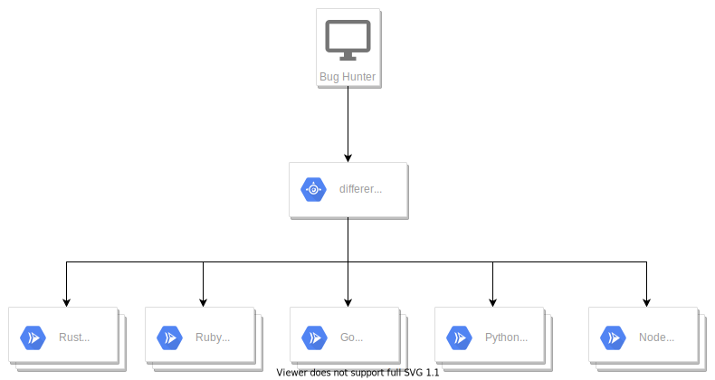

## Run the project using GCP

`differer` runs on App Engine Standard environment in the smallest free tier allowed instance and configured to shut down itself if no requests arrive in 1 hour. This is my current `app.yaml` file:

```yaml
runtime: go113
instance_class: F1

main: github.com/jimen0/differer/cmd/differer

default_expiration: 1h

env_variables:
  DIFFERER_CONFIG: "config.yaml"
```

You can deploy it as easily as `gcloud app deploy .` once you configure [`gcloud`](https://cloud.google.com/sdk/gcloud).

Each `runner` is a Cloud Run instance configured to be as small as possible but allowing them to process a decent number of concurrent requests:

```console
gcloud run deploy python-parseurl \
    --image=gcr.io/REDACTED/python-parseurl:latest \
    --concurrency=60 \
    --platform=managed \
    --memory=128Mi \
    --max-instances=4 \
    --timeout=10 \
    --region=europe-west1
```

> **NOTE**: Please note that this deployment will allow unauthenticated HTTP requests! You will have to tweak the configuration a bit if you want to protect your environment a bit more and only allow authenticated requests. No worries, Google's documentation is awesome.

There's no need to use Cloud Run. As long as your runners can receive the jobs over `HTTP`, they can run anywhere you want.

## Diagram

Here's a simplified diagram of the GCP architecture. Please, remember to set the rules in App Engine and Cloud Run so only you can trigger the parsers!


